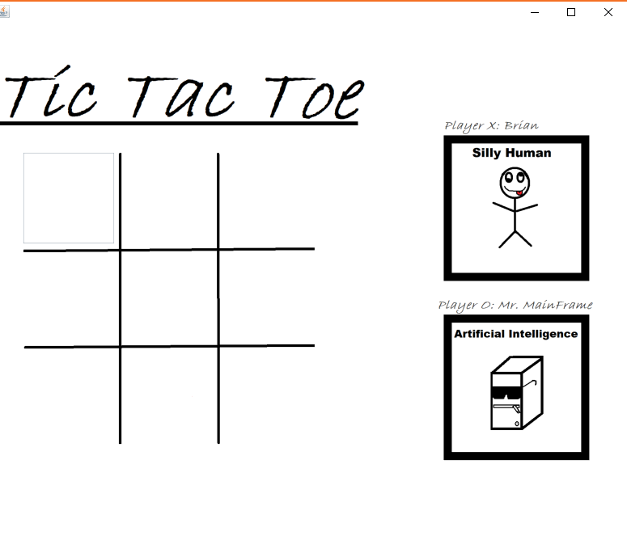
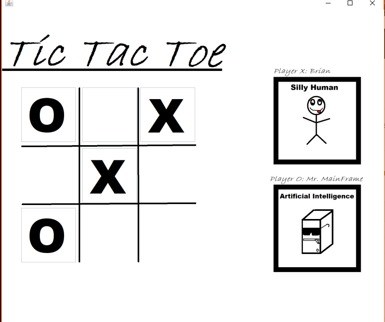
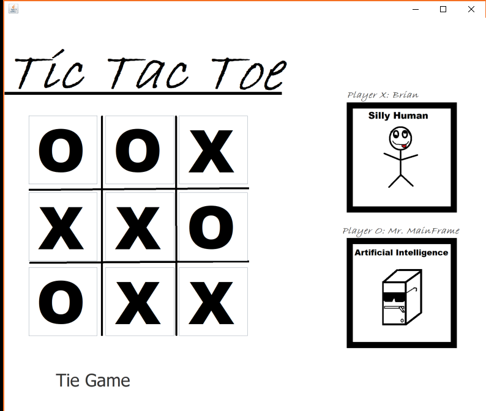

# TicTacToe
## Description:
#### This program is a Tic Tac Toe game that plays against an Artifical Intellenge. The program was built using Java Swing and Java. The program is capable of operating on Linux, Windows and Mac operating systems. In this program the user is playing against an AI component named Mr. MainFrame. Mr. MainFrame is a ego driven AI that uses text to speech software to insult the human player after every turn. The AI is pretty good and results in either the human player losing or tie game in most cases.

